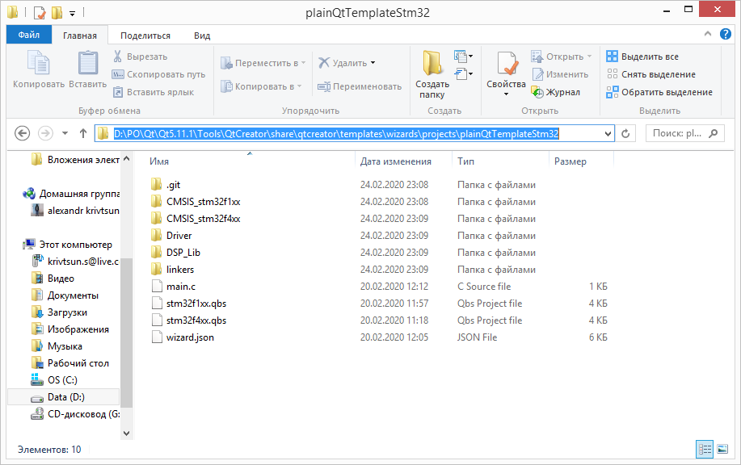
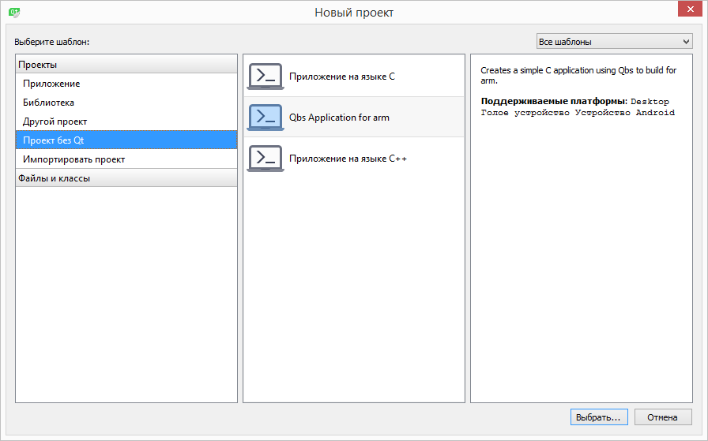
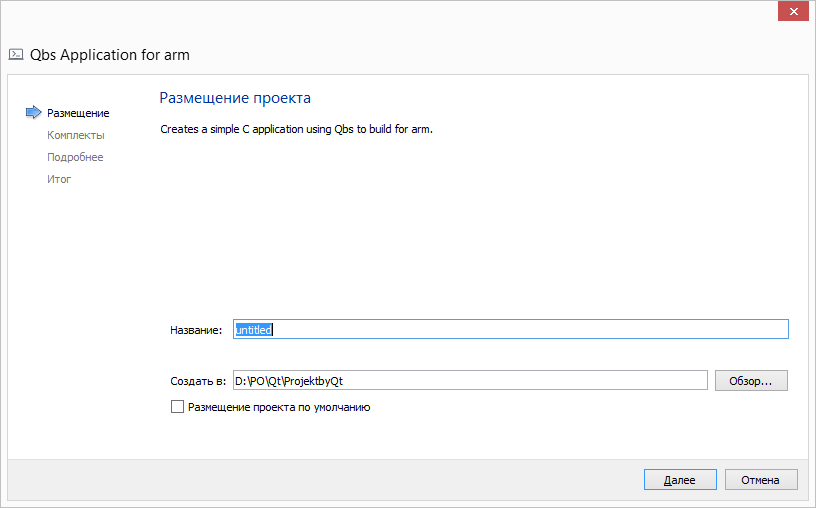
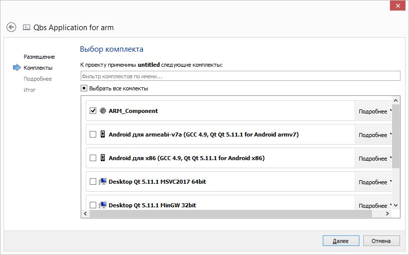
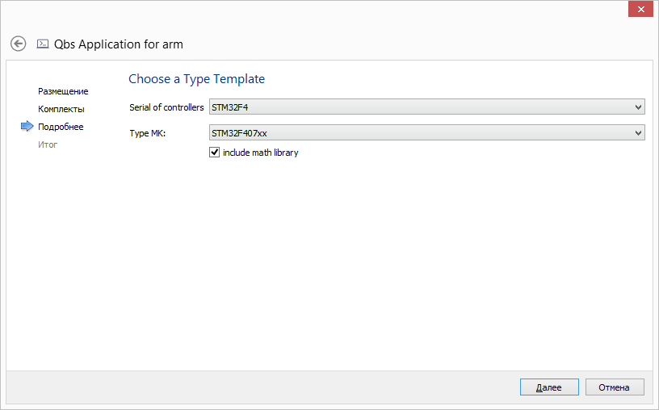

# QtTemplateStm32
Template for QtCreator
must be in: `[Qtdir]\Tools\QtCreator\share\qtcreator\templates\wizards\projects\plainQtTemplateStm32`

NOTE uploading files lasts ~ 1.2 minutes without library math faster

# TODO
- [ ] Add include source math lib in .qbs
- [ ] Add serial F0,F2,F3,F7
- [ ] Add lincers failes
